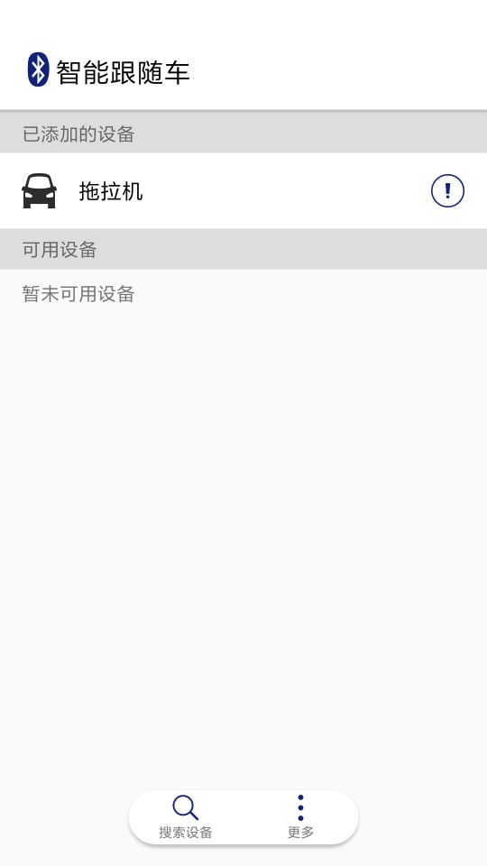

#智能跟随车APP
---
本项目为智能互联比赛项目

##概述
###项目介绍
本项目想通过手机来控制小车的运动，来解放人们的双手，方便人们生活。
###项目功能
> 通过项目归纳总结，预计有如下几点功能
> 
1. 蓝牙搜索功能
2. 蓝牙连接功能
3. 蓝牙发送数据
4. 可保存搜索到，连接过的设备
5. 可对相关设备进行个性化操作

##蓝牙模块
作为手机与硬件相互通信的关键。通过查阅资料
[http://blog.csdn.net/Charon1997/article/details/72895734](http://blog.csdn.net/Charon1997/article/details/72895734 "Android 蓝牙BLE开发详解")
了解了相关知识。

首页截图
###搜索功能
通过点击按钮进行搜索

点击搜索

正在搜索

点击搜索设备

###设备编辑

可以编辑和删除

可以修改其名字
###设备连接

此界面进行连接并给硬件发数据

退出连接